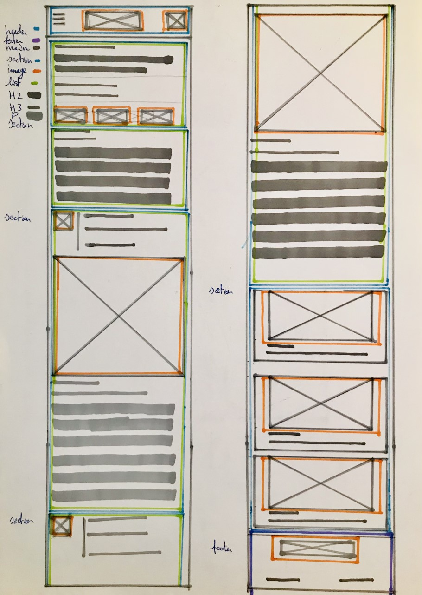

# Procesverslag https://omarjesuss.github.io/frontend/
**Auteur:** -Omar Vasquez Jesus-

Markdown cheat cheet: [Hulp bij het schrijven van Markdown](https://github.com/adam-p/markdown-here/wiki/Markdown-Cheatsheet). Nb. de standaardstructuur en de spartaanse opmaak zijn helemaal prima. Het gaat om de inhoud van je procesverslag. Besteedt de tijd voor pracht en praal aan je website.

## Bronnenlijst
1. https://www.liveabout.com/best-hip-hop-debut-albums-2858029
2. https://www.htmldog.com/techniques/dropdowns/
3. https://validator.w3.org/
4. http://minifycode.com/
5. https://www.youtube.com/watch?v=RNakAX3rVVw
6. https://css-tricks.com/typography-for-developers/
7. https://www.youtube.com/watch?v=jx5jmI0UlXU
8. https://courses.wesbos.com/account/access/6034cbd22a34157df9edc504
9. https://css-tricks.com/snippets/css/a-guide-to-flexbox/
10. https://www.youtube.com/watch?v=br-0i3U1VCA
11. box shadow: https://css-tricks.com/almanac/properties/b/box-shadow/

## Eindgesprek (week 7/8)

-dit ging goed & dit was lastig-

**Screenshot(s):**

-screenshot(s) van je eindresultaat-

## Voortgang 3 (week 6)

- dropdown menu toevoegen in de nav
- articles in een section zetten
- links afsluiten

## Voortgang 2 (week 5)

- geen li elementen maar articles
- logo is svg
- maken van onderste galerij met css grid of flexbox?
- hele footer tekst is een link
- link binnen title description

## Voortgang 1 (week 3)
- geen hoofdletters in de html tags
- geen ol en li maar articles van de lijst maken
- een aside maken
- een span gebruiken voor de nummers van de lijst
- de gehele HTML structuur eerst goed krijgen

### Stand van zaken
- onderste galerij opmaken in css grid 4 naast elkaar. css grid> container> article> img> p. image in de css expact ratio= 1:1.
- span maken voor de lijst 1 t/m 10.
- alleen 1 section gebruiken en hier alle articles in plaatsen.
- nav hamburger menu van maken voor mobile, display none op de submenu's.

**Screenshot(s):**

-screenshot(s) van hoe ver je bent met korte uitleg-

### Agenda voor meeting

-samen met je groepje opstellen-

| student 1      | student 2          | student 3    | student 4        |
| ---            | ---                | ---          | ---              |
| dit bespreken  | en dit             | en ik dit    | en dan ik dat    |
| an dat ook nog | dit als er tijd is | nog een punt | dit wil ik zeker |
| ...            | ...                | ...          | ...              |

### Verslag van meeting

-na afloop snel uitkomsten vastleggen-

## Breakdownschets (week 1)

-uitwerken voor de 1e werkgroep - eind van de eerste week-

## Intake (week 1)
-uitwerken voor de kick-off werkgroep - begin van de eerste week-

**Je startniveau:** -blauw-

**Je focus:** -surface laag-

**Je opdracht:** -https://www.liveabout.com/best-hip-hop-debut-albums-2858029-

**Screenshot(s) van de eerste pagina (small screen):**

https://github.com/omarjesuss/frontend/blob/main/images/homepage.PNG?raw=true

**Screenshot(s) van de tweede pagina (small screen):**

https://github.com/omarjesuss/frontend/blob/main/images/list.PNG?raw=true
